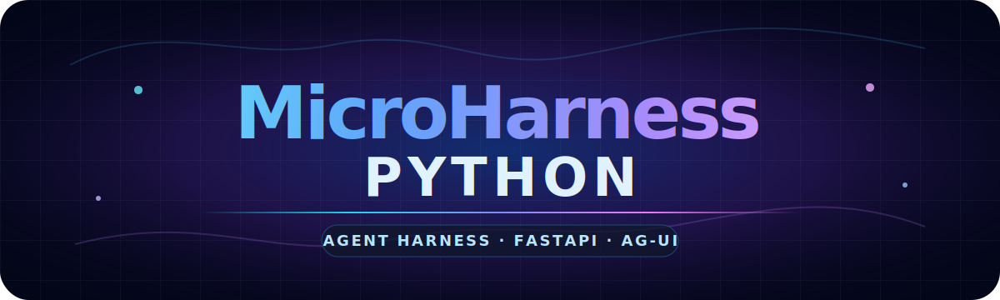

# MicroHarness Python




MicroHarness Python es un ejemplo mínimo, didáctico y ejecutable de **Agent Harness** con Microsoft Agent Framework. Muestra cómo convertir un modelo de chat en un agente operativo añadiendo contexto controlado, tools, subagentes, memoria de sesión, lifecycle hooks y publicación con **FastAPI + AG-UI**.

El repositorio incluye dos recorridos complementarios:

- **Microharness didáctico:** implementa memoria, contexto, sesiones y hooks con código local muy pequeño para explicar las ideas paso a paso.
- **Variante MAF-native:** usa primitivas nativas de Microsoft Agent Framework como `AgentSession`, `ContextProvider`, `FileHistoryProvider`, `MemoryContextProvider`, `TodoProvider`, `ToolApprovalMiddleware` y middleware de agente/functions.

La solución está pensada para demostraciones técnicas, aprendizaje incremental y revisiones rápidas desde GitHub sin depender de una plataforma compleja.

## Versión de la solución

**Versión actual:** `v0.2.0`

Esta versión cubre el recorrido completo del harness y añade una variante MAF-native real: configuración segura, contexto, skills, subagentes/workflows, memoria local, lifecycle hooks, API JSON, streaming AG-UI, interfaz web local y ejemplos con `AgentSession`, `ContextProvider`, `FileHistoryProvider`, `MemoryContextProvider`, `TodoProvider` y middleware de Microsoft Agent Framework.

## Tabla de contenidos

- [Características](#características)
- [Arquitectura](#arquitectura)
- [Estructura del repositorio](#estructura-del-repositorio)
- [Requisitos](#requisitos)
- [Instalación](#instalación)
- [Configuración](#configuración)
- [Ejecución](#ejecución)
- [Notebooks](#notebooks)
- [Artefactos de ejecución](#artefactos-de-ejecución)
- [Validación](#validación)
- [Seguridad](#seguridad)

## Características

- **Agent Loop**: observa la petición, decide si necesita skills, incorpora resultados y sintetiza una respuesta.
- **Context Manager**: empaqueta conocimiento local y hechos persistidos antes de cada turno.
- **Skills / Tools**: expone funciones Python tipadas al agente mediante `@tool`.
- **Subagentes deterministas**: delega análisis acotados a especialistas de arquitectura, fiabilidad y seguridad.
- **Memoria local**: mantiene estado JSON, facts por sesión, trazas de tools y artefactos Markdown.
- **Lifecycle Hooks**: registra eventos `before_request`, `after_request`, `before_tool` y `after_tool` en JSONL.
- **FastAPI + AG-UI**: publica endpoint streaming `/agent`, endpoint JSON `/api/chat` e interfaz local `/ui/`.
- **Variante MAF-native**: publica `/api/chat/maf-native` y `/agent/maf-native` con historial, memoria, todos y middleware nativos de Agent Framework.
- **Recorrido guiado**: incluye notebooks incrementales para explicar cada componente paso a paso.

## Arquitectura

```text
Browser / CLI / Notebook
        ↓
FastAPI + AG-UI
        ↓
Microsoft Agent Framework Agent
        ↓
MicroHarness runtime
  ├─ configuration
  ├─ context manager
  ├─ skills / tools
  ├─ deterministic sub-agents
  ├─ file-backed memory
  └─ lifecycle hooks
        ↓
Azure OpenAI / compatible model endpoint
```

## Estructura del repositorio

```text
src/microharness/
  config.py       # carga segura de configuración local
  context.py      # context manager
  lifecycle.py    # hooks y trazas JSONL
  subagents.py    # especialistas acotados
  tools.py        # skills del agente
  memory.py       # persistencia local
  harness.py      # construcción del Agent Framework Agent
  maf_native.py   # variante con primitivas nativas de Agent Framework
  server.py       # FastAPI + AG-UI + endpoint JSON
  client.py       # cliente terminal AG-UI interactivo
docs/
  architecture.md
notebooks/
  01_configuracion_entorno.ipynb
  02_context_manager.ipynb
  03_skills_y_tools.ipynb
  04_subagentes.ipynb
  05_memoria_y_sesiones.ipynb
  06_lifecycle_hooks.ipynb
  07_fastapi_agui.ipynb
scripts/
  load_model_from_akv.sh
  run_request.py
  run_server.sh
  smoke_agui.py
working/
  contexto_harness.md
  reference/
  output/
web/static/
  index.html
```

## Requisitos

- Python 3.10 o superior.
- Un despliegue de Azure OpenAI o un endpoint compatible con OpenAI.
- Azure CLI autenticado si se cargan valores desde Azure Key Vault.

El repositorio no contiene secretos. Usa `.env` local, variables de entorno o `scripts/load_model_from_akv.sh`.

## Instalación

```bash
python -m venv .venv
source .venv/bin/activate
python -m pip install --upgrade pip
python -m pip install --pre -e '.[dev]'
```

## Configuración

Opción recomendada para entornos con Azure Key Vault:

```bash
source scripts/load_model_from_akv.sh
```

o copia `.env.example` a `.env` y rellena valores locales:

```bash
AZURE_OPENAI_BASE_URL="https://<resource>.openai.azure.com/openai/v1"
AZURE_OPENAI_API_KEY="<your-api-key>"
AZURE_OPENAI_CHAT_COMPLETION_MODEL="<your-deployment-name>"
MICROHARNESS_HOST="127.0.0.1"
MICROHARNESS_PORT="8000"
```

## Ejecución

Arranca el servidor:

```bash
source .venv/bin/activate
source scripts/load_model_from_akv.sh
python -m microharness.server
```

Endpoints locales:

| Recurso | URL |
| --- | --- |
| Interfaz web | `http://127.0.0.1:8000/ui/` |
| Stream AG-UI | `http://127.0.0.1:8000/agent` |
| API JSON | `http://127.0.0.1:8000/api/chat` |
| Stream AG-UI MAF-native | `http://127.0.0.1:8000/agent/maf-native` |
| API JSON MAF-native | `http://127.0.0.1:8000/api/chat/maf-native` |
| Health | `http://127.0.0.1:8000/health` |
| Health extendido | `http://127.0.0.1:8000/healthz` |

Prueba rápida del endpoint JSON:

```bash
python scripts/run_request.py
```

Prueba rápida del endpoint JSON con primitivas nativas de Agent Framework:

```bash
python scripts/run_native_request.py
```

Prueba rápida del stream AG-UI:

```bash
python scripts/smoke_agui.py "Explica el context manager del harness"
```

## Notebooks

Los notebooks forman un recorrido incremental por la construcción del harness:

| # | Notebook | Objetivo |
| --- | --- | --- |
| 1 | `notebooks/01_configuracion_entorno.ipynb` | Variables, `.env`, Key Vault y `Settings`. |
| 2 | `notebooks/02_context_manager.ipynb` | Lectura de conocimiento local y composición del contexto. |
| 3 | `notebooks/03_skills_y_tools.ipynb` | Tools tipadas, artefactos y permisos. |
| 4 | `notebooks/04_subagentes.ipynb` | Delegación a especialistas acotados. |
| 5 | `notebooks/05_memoria_y_sesiones.ipynb` | Facts, estado JSON y continuidad. |
| 6 | `notebooks/06_lifecycle_hooks.ipynb` | Trazas alrededor de peticiones y tools. |
| 7 | `notebooks/07_fastapi_agui.ipynb` | Publicación con FastAPI, `/api/chat` y `/agent`. |

## Artefactos de ejecución

El runtime escribe únicamente en `working/output/`:

- `agent_summary.md`: último artefacto generado.
- `session_state.json`: contador de ejecuciones, facts y trazas de tools.
- `lifecycle_trace.jsonl`: eventos de hooks.

`working/reference/` contiene respuestas reproducibles para ejecutar el recorrido sin credenciales de modelo.

## Validación

```bash
python -m compileall src scripts tests
PYTHONPATH=src python -m pytest
python -m ruff check .
```

## Seguridad

- No se commitean claves, tokens, endpoints privados ni `.env`.
- `.env.example` contiene solo placeholders.
- Las skills incluidas son locales y no destructivas.
- Las acciones sensibles deben modelarse con aprobación humana.

## Licencia

Este proyecto se distribuye bajo licencia MIT.
