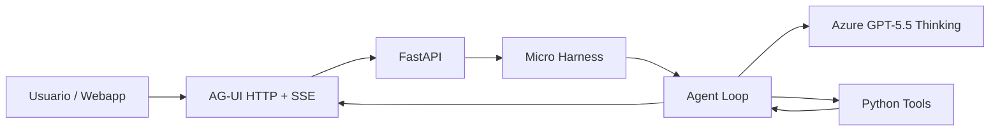

# Demo flow

Duración sugerida: 5 minutos.

## 1. Problema

Un modelo por sí solo no es un agente operativo. Necesita un harness mínimo que le dé:

- instrucciones,
- herramientas,
- contexto,
- sesión,
- transporte para clientes externos.

## 2. Solución MicroHarness

## 3. Narrativa técnica

1. Abrir `http://127.0.0.1:8000/ui/`.
2. Preguntar: “Explica el agent loop y usa una herramienta”.
3. Enseñar que el streaming llega como eventos AG-UI.
4. Ejecutar `python scripts/run_demo_client.py` para mostrar la ruta estable `/api/chat`.
5. Abrir `working/output/demo_summary.md` y `working/output/session_state.json`.
6. Explicar que esta memoria es local y que el siguiente paso sería persistencia real.

## 4. Plan B sin internet

Si el modelo o Azure no responden:

- mostrar el código del harness,
- abrir la webapp,
- enseñar los tools simulados,
- explicar el contrato AG-UI con el diagrama,
- mostrar `working/fallback/expected_response.md`,
- ejecutar el cliente, que activa fallback local si el servidor no responde.

## 5. Mensaje final

El harness no es “más prompt”. Es la capa que convierte un modelo en software operable: decide, usa herramientas, conserva sesión, transmite eventos y se puede gobernar.
