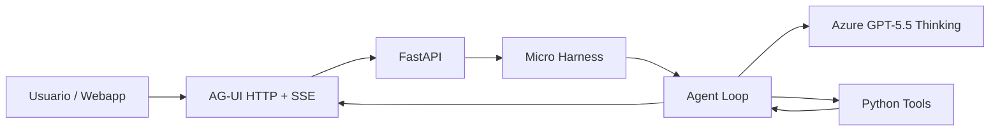

# Demo flow

Duración sugerida: 8–10 minutos.

## 1. Problema

Un modelo por sí solo no es un agente operativo. Necesita un harness mínimo que le dé:

- instrucciones,
- herramientas,
- contexto,
- sesión,
- transporte para clientes externos.

## 2. Solución MicroHarness

## 3. Narrativa técnica

1. Abrir `http://127.0.0.1:8888/ui/`.
2. Preguntar: “Explica el agent loop y usa una herramienta”.
3. Enseñar que el streaming llega como eventos AG-UI.
4. Preguntar: “Recuerda que esta sesión es para una charla pública”.
5. Preguntar: “Lee el contexto de la sesión live-demo”.
6. Explicar que esta memoria es solo de proceso y que el siguiente paso sería persistencia.
7. Preguntar: “Propón cómo extender esto a MCP y Foundry”.
8. Activar approvals si hay tiempo con `MICROHARNESS_REQUIRE_CONFIRMATION=true`.

## 4. Plan B sin internet

Si el modelo o Azure no responden:

- mostrar el código del harness,
- abrir la webapp,
- enseñar los tools simulados,
- explicar el contrato AG-UI con el diagrama,
- ejecutar solo `/healthz` si la configuración está cargada.

## 5. Mensaje final

El harness no es “más prompt”. Es la capa que convierte un modelo en software operable: decide, usa herramientas, conserva sesión, transmite eventos y se puede gobernar.
